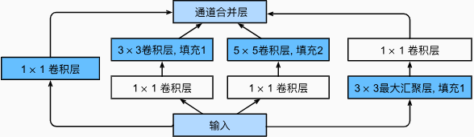
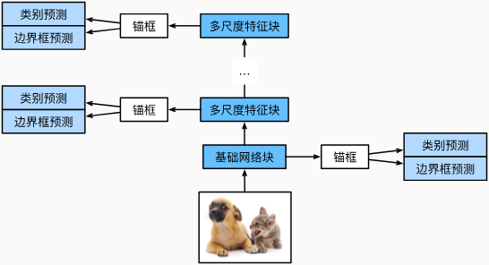
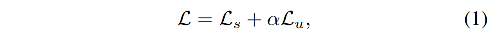

# Transformer


- 首先这里介绍的模型，其目标是接受一段文本，预测下一个词。这里介绍的注意力指的是自注意力（self-attention)。自注意力（Self-Attention）之所以被称为“自”，是因为它处理的是同一个序列内部的信息，即一个序列中的每个元素都能够关注到该序列中其他所有元素。这种机制允许模型在处理某个位置的元素时，能够同时考虑到整个序列内其他位置的相关信息。这里的“自”体现了信息来源于自身序列的特点。
- Transformer：头端是嵌入矩阵（将token转化为高维向量），中间层是Attention和MLP的层层堆叠（GPT-3堆叠96次），尾端是解嵌入矩阵（用最后一个embedding做预测，输出每个token的概率）
- 使用softmax将数列转换为概率时，给指数加个分母T（temperature），当T较大时，会给低值赋予更多权重，使得分布更加均匀，当T较小时，那么较大的数占据优势，特别的，当T为0时，意味着所有权重都给到最大值。
- 高维空间的方向可以对应到某一语义
- Transformer的目标是逐步调整这些embedding，使他们不仅仅编码单个token，还能够融入更加丰富的上下文含义。
- 训练好的注意力模块能计算出，需要给初始的泛型嵌入加个什么向量，才能把它移动到上下文对应的具体方向上。注意力模块不仅精细化了一个词的含义，还允许模型相关传递这些嵌入向量所蕴含的信息。
- 如果模型要准确预测下一个词，该序列的最后一个嵌入向量必须经过所有注意力模块的更新，以包含远程单个词的信息量。也就是要设法编码整个上下文窗口中与预测下一个词相关的所有信息。
- 查询向量(Q)：由矩阵Wq和嵌入向量E，Wq * E = Q。代表了当前要查询的信息。同时将嵌入空间中的词映射到低维的查询空间中。
- 键向量 (K)：由矩阵Wk和嵌入向量E，Wk * E = K。可以把“键”视为想要回答“查询”。同样的将嵌入空间中的词映射到低维的键空间中。
- 当键与查询的方向相齐时，就能认为他们相匹配。为了衡量每个键与每个查询的匹配程度，要计算所有可能的键-查询对之间的点积。然后对于询问与每个查询的结果除以键-查询空间的维度的平方根（为了数值稳定性）使用softmax函数做归一化。
- 同时为了避免后方的token影响前方位置的token，这些点在矩阵中会全部变为负无穷再做上面的softamx，这一过程称为masking（掩码）。有的注意力机制不使用掩码。
- QK矩阵大小为上下文长度的平方，这就是为何上下文长度会成为大语言模型的巨大瓶颈。
- 值向量 (V)：计算出上面矩阵后，就能让模型推断出每个词与其他哪些词有关，那么接下来就更新嵌入向量，把各个词的信息传递给与之相关的词。通过值矩阵，将它乘以前面那个词的embedding，得到的结果就是值向量，Wv * E_(i-1) = V。这个值就是你要个后词的embedding所加的向量。值向量与嵌入向量处于同一个高维空间。值矩阵乘以一个词的嵌入向量可以理解为：如果这个词需要调整目标词的含义，要反映这一点，得对目标词的embedding加入什么向量呢？
- 将值矩阵与所有嵌入向量E相乘就可以得到一系列值向量，同时对于每个词的那一列需要给每个值向量乘以该列对应的权重（这个权重就是QK矩阵经过softmax后的输出），然后对该列进行加和，然后再加入到原始的嵌入向量中，就得到一个更加精准的向量，编码了更丰富的上下文信息。对其他嵌入向量做同样的操作后就得到了一系列更加精准的向量。
- 上面说的是单注意力头，而Transformer中的注意力模块由多头注意力组成，大量并行地执行上述单注意力头的操作（例如，GPT-3每个模块内使用96个注意力头），而每个头都有不同的键，查询，值矩阵，不同的头产生不同的注意力模式。然后对于某个词，将各个头给出的变化量加到初始嵌入向量，最后便得到了更为精准的嵌入向量。
- 嵌入矩阵、Attention层、解嵌入矩阵的参数大约共占整个Transformer参数量的三分之一，剩余的三分之二则是MLP层的参数。尽管关于事实存储的完整机制尚未揭示，但有一条普适的高级结论：事实似乎存储在神经网络中的MLP模块中。
- 若一个编码了“名字迈克尔”“姓氏乔丹”的向量流入MLP，那么经过一系列计算，能够输出包含“篮球”方向的向量，再将其原向量相加，得到输出向量。
- MLP模块：该过程的第一步是将输入向量与一个超大矩阵（升维投影矩阵）相乘，可以设想矩阵的每一行作为一个向量，可以设想第一行恰好为假想存在的“名字迈克尔”这一方向，那么输出向量的第一个分类为1（若向量编码了“名字迈克尔”）或为0或负数（没编码“名字迈克尔”）。可以想象其他行也在并行的提问各种问题，探查嵌入向量的其他各类特征，同时还会加上一列偏置向量Bias。通过这个矩阵（GPT-3是（4×12288）49152×12288）将向量映射到更高维的空间。该操作是线性的，但语言是高度非线性的，“迈克尔.乔丹”的测量值可能被“迈克尔.XX"或”XX.乔丹“所影响，所以需要第二步：通过一个简单的非线性函数ReLU或GELU后，得到的结果就会很干净。接下来第三步和第一步很相似，也是先左乘一个超大矩阵（降维投影矩阵），然后加上一个偏置项，此时，输出向量的维数降回到嵌入空间的维数，这个矩阵中的列能够说明若对应的神经元被激活，则将在结果添加什么信息，完成之后便能够输出包含”篮球“方向的向量，最后再将其原向量相加，得到输出向量。请注意，这个过程对所有向量并行进行，那么就是矩阵乘矩阵了。
- 然而，证据表明，单个神经元几乎不会代表像”迈克尔.乔丹“这样的单一特征，这与如今可解释性研究中的Superposition(叠加)概念有关，这个假设有助于解释为什么模型难以解释，以及为什么模型扩展性出奇的好。其基本思想是：在一个N维空间中，若是想用一堆正交基表示各种不同的特征，这样在一个方向添加向量就不会影响其他反向，那么最多能容纳N个向量。但若放宽一些限制，比如允许这些特征对应的向量并不完全垂直，而是几乎垂直，比如89°~91°之间。约翰逊-林登斯特劳斯引理的一个结果是，能在空间中塞进几乎垂直的向量数量，随维数增加指数增长。这对大语言模型意义重大，能将相互独立的概念与几乎垂直的向量相关联而受益，意味着能在有限的空间维数中存储数量多得多的各种概念，这可能部分解释了为什么模型性能随规模扩大而提升显著。
- 升维投影矩阵和降维投影矩阵是MLP中的主要参数，而这样的MLP在GPT-3中共有96层，这些参数加起来约有1160亿，占神经网络的三分之二，而将前面的注意力模块，嵌入矩阵，解嵌入矩阵加起来就能得到GPT-3宣传的1750亿个总参数量。

------

- 自回归模型：对见过的数据建模，即它通过使用过去的时间点来预测未来值。
- 马尔可夫假设：假设当前数据只跟T个过去时间点相关，即在一个序列中只考虑某个长度为T的时间跨度。最直接的好处是参数的总数量不变，坏处是可能存在跨度为T之外的有效信息无法观测到。
- 潜变量模型：保留过去观察的一些总结h_t，并且同时更新x_hat_t和总结h_t。总的来说就是使用潜变量来概括历史信息。
- 为了训练语言模型，我们需要计算单词的概率， 以及给定前面几个单词后出现某个单词的条件概率。 这些概率本质上就是语言模型的参数。
- 当序列（理解为词组）很长时，因为文本量不够大，可能导致某些序列（词组）出现的次数很小，甚至没有出现过。
- N元语法：使用马尔可夫假设可以缓解上面问题。例如处理一个序列（词组）时一元语法：就变为了各个词直接是独立的，二元语法：则当前词只与前面的一个词有关系，三元语法：当前词只与前面的两个词有关系。这样就可以处理长序列了。
- 若只有100个词的话，二元语法就需要10000个二元组，三元语法需要1000000个三元组。但得益于语言的结构性，再做个低频过滤，实际上的元组数量其实并没有那么大。可以发现单词的频率是满足齐普夫定律的。所以元组是可以稍微做长一些的。
- RNN的每一层可以看作是多个隐藏神经元组成，类似MLP中的隐藏层，不同的是RNN的隐藏状态不仅依赖当前输入，还依赖前一个状态的隐藏状态。
- 困惑度：平均交叉熵，可以看作n次分类。困惑度是对平均交叉熵做了个指数，1表示完美，无穷大是最差情况。
- 梯度裁剪：迭代中计算多个时间步上的梯度，在方向传播过程中会产生对应长度的矩阵乘法链，导致数值不稳定。梯度裁剪能有效预防梯度爆炸，具体来说，入股梯度长度超过θ，那么拖影会长度θ。
- 做RNN时候处理不了太长序列，因为当时间太长时，隐藏状态累计了太多东西，对于前面的信息不太好抽取信息了。

------

# GRU（Gated Recurrent Unit）详解

GRU（Gated Recurrent Unit）是一种改进的**循环神经网络（RNN）**，专门为了解决传统RNN中的一些问题而设计，尤其是**梯度消失**和**长距离依赖**的问题。GRU通过**门控机制**来控制信息的流动，使得网络能够更好地记住重要信息，丢弃不重要的信息。

### 1. GRU的结构
GRU的结构与传统RNN相比有一些关键的改进。传统RNN每个时间步的隐藏状态是单一的，而GRU引入了**两个门**来控制信息流动：**更新门**和**重置门**。

- **更新门（Update Gate）**: 控制从前一个时间步传递过来的信息有多少需要保留，多少需要更新。这类似于LSTM中的遗忘门和输入门的结合。它能够判断当前时刻的信息是否重要，从而决定保留多少之前的记忆。

- **重置门（Reset Gate）**: 控制是否忘记前一个时间步的隐藏状态，也就是允许网络“重置”隐藏状态。如果重置门接近0，则当前时刻会忽略之前的记忆，只依赖当前输入进行计算。

### 2. GRU的核心公式
GRU的运算可以分为以下几步：

- **更新门**决定保留多少过去的隐藏状态：
  $$
  z_t = \sigma(W_z \cdot [h_{t-1}, x_t])
  $$
  其中，$z_t$ 是更新门的输出，$ W_z $ 是权重矩阵，$ h_{t-1} $ 是前一个时间步的隐藏状态，$ x_t $ 是当前时间步的输入，$ \sigma $ 是sigmoid激活函数。

- **重置门**决定前一时刻的信息是否被遗忘：
  $$
  r_t = \sigma(W_r \cdot [h_{t-1}, x_t])
  $$
  其中， r_t  是重置门的输出，$ W_r $ 是重置门的权重矩阵。

- **候选隐藏状态** $ \tilde{h}_t $ 计算如下，它结合当前的输入和过去的信息（在重置门的调节下）：
  $$
  \tilde{h}_t = \tanh(W_h \cdot [r_t \ast h_{t-1}, x_t])
  $$
  这里 $ \ast $ 表示元素逐项相乘（Hadamard乘积），即只保留前一个隐藏状态中被重置门选中的部分。

- **最终的隐藏状态** $ h_t $ 是通过更新门来在之前的隐藏状态 $ h_{t-1} $ 和新的候选隐藏状态 $ \tilde{h}_t $ 之间进行选择：
  $$
  h_t = z_t \ast h_{t-1} + (1 - z_t) \ast \tilde{h}_t
  $$
  这个公式可以理解为，更新门 $ z_t $ 决定了多少过去的记忆 $ h_{t-1} $ 被保留，而 $ 1 - z_t $ 决定了多少当前的新信息 $ \tilde{h}_t $ 会替代旧的信息。

极端情况z=0,r=1，就是RNN，前一时刻的隐藏状态被用于候选状态的计算，但被完全抛弃，最终隐藏状态只依赖当前输入。z=1,r=0,前一时刻的隐藏状态完全保留，当前输入不会对隐藏状态产生影响。

### 3. GRU的优势
GRU与传统RNN相比有很多优势，甚至与LSTM相比也是一种更简洁、高效的替代方案：

- **简化结构**：相比LSTM，GRU结构更简单，少了一个门（GRU有两个门，LSTM有三个门）。这使得GRU计算开销相对较低，同时还能提供与LSTM类似的性能。
  
- **缓解梯度消失问题**：传统RNN在处理长时间依赖时容易出现梯度消失，导致模型无法学习到长序列中的依赖关系。GRU通过门控机制有效解决了这一问题，能够更好地保留重要的长时间依赖信息。

- **更快的训练速度**：由于GRU的门控机制比LSTM简单，它在某些任务上能够实现更快的训练速度，同时性能不会下降太多。

- **高效性**：在处理短期依赖时，GRU的表现通常与LSTM相似，但因为其结构简化，实际应用中GRU往往在计算成本上更具优势。

### 4. GRU的应用场景
GRU广泛应用于需要处理序列数据的场景中，常见的任务包括：

- **自然语言处理（NLP）**：如机器翻译、文本生成、情感分析等任务，GRU可以很好地处理文本中的上下文依赖。
- **时间序列预测**：如股票价格预测、天气预报、传感器数据分析等，GRU擅长捕捉时间序列中的模式。
- **语音识别**：处理音频数据，GRU能够学习到音频信号的序列特征。

PyTorch中LSTM的实现

```python
import torch
import torch.nn as nn

# 定义GRU层
# input_size: 输入特征的维度
# hidden_size: 隐藏层的神经元个数
# num_layers: GRU的层数
gru = nn.GRU(input_size=10, hidden_size=20, num_layers=2)

# 创建输入数据 (序列长度, batch_size, 输入维度)
input_data = torch.randn(5, 3, 10)  # 序列长度为5，batch_size为3，输入维度为10

# 初始化隐藏状态 (num_layers, batch_size, hidden_size)
h0 = torch.randn(2, 3, 20)  # GRU没有记忆单元，只需初始化隐藏状态

# 前向传播
output, hn = gru(input_data, h0)

# 输出结果
print(output.shape)  # (序列长度, batch_size, hidden_size)
print(hn.shape)      # (num_layers, batch_size, hidden_size)
```

### 5. GRU与LSTM的比较

| **特性**         | **GRU**                                    | **LSTM**                             |
| ---------------- | ------------------------------------------ | ------------------------------------ |
| **门的数量**     | 2个（更新门和重置门）                      | 3个（输入门、遗忘门、输出门）        |
| **隐藏状态更新** | 更加简化的隐藏状态更新机制                 | 更复杂的单元状态和隐藏状态更新机制   |
| **记忆能力**     | 能够处理长短期依赖，适合多种序列数据       | 尤其适合长时间依赖的序列数据         |
| **计算效率**     | 结构较简单，训练速度更快，计算效率更高     | 结构复杂，计算开销较大               |
| **适用场景**     | 大多数任务中表现优异，尤其是中短期依赖问题 | 更适合处理长时间依赖且数据复杂的任务 |

### 总结
GRU是RNN的改进版本，通过引入门控机制，在序列数据处理中能够更好地处理长距离依赖和短期依赖问题。相比LSTM，GRU结构更简化，计算效率更高，因此在许多应用中，它是LSTM的高效替代品。

# LSTM（长短期记忆网络）

LSTM（Long Short-Term Memory，长短期记忆网络）是一种特殊的 **循环神经网络（RNN）**，用来解决普通RNN在长序列中表现不佳的问题。普通RNN因为在反向传播过程中存在**梯度消失**或**梯度爆炸**的问题，难以捕捉长时间的依赖关系，而LSTM通过引入**记忆单元**和**门机制**，可以更好地处理长期依赖。

## LSTM结构

LSTM的核心在于其特殊的单元结构，它由几个**门（Gate）**组成，这些门控制信息在网络中的流动，决定哪些信息应该保留，哪些应该丢弃。具体来说，LSTM单元包括：

1. **遗忘门（Forget Gate）**  
   决定应该忘记多少过去的状态。该门通过输入当前的输入 $$x_t$$ 和上一个隐藏状态 $$h_{t-1}$$ 计算得到：
   $$
   f_t = \sigma(W_f \cdot [h_{t-1}, x_t] + b_f)
   $$
   其中，$$W_f$$ 是权重矩阵，$$b_f$$ 是偏置，$$\sigma$$ 是激活函数（通常为 sigmoid 函数，输出值在 [0, 1] 之间，表示遗忘的比例）。

2. **输入门（Input Gate）**  
   控制当前的输入 $$x_t$$ 对记忆单元状态的影响。该门由两部分组成：

   - **更新门**决定新信息的更新量：
     $$
     i_t = \sigma(W_i \cdot [h_{t-1}, x_t] + b_i)
     $$
   - **候选记忆单元**，生成一个新的候选值 $$\tilde{C_t}$$：
     $$
     \tilde{C_t} = \tanh(W_C \cdot [h_{t-1}, x_t] + b_C)
     $$
     输入门和候选记忆单元共同决定了新的记忆内容。

3. **记忆单元状态更新**  
   记忆单元的状态 $$C_t$$ 是LSTM中保存长期信息的部分，它会基于遗忘门和输入门更新：
   $$
   C_t = f_t \cdot C_{t-1} + i_t \cdot \tilde{C_t}
   $$
   这一步将旧记忆和新记忆结合起来，更新到新的记忆状态。

4. **输出门（Output Gate）**  
   决定当前时刻的输出以及下一个隐藏状态 $$h_t$$。输出门通过当前输入和上一个隐藏状态计算：
   $$
   o_t = \sigma(W_o \cdot [h_{t-1}, x_t] + b_o)
   $$
   然后计算当前的隐藏状态 $$h_t$$：
   $$
   h_t = o_t \cdot \tanh(C_t)
   $$
   其中，$$C_t$$ 是通过前面的记忆单元状态更新得到的。

## LSTM的运行过程

在每一个时间步 $$t$$，LSTM执行以下步骤：

1. 读取当前的输入 $$x_t$$ 和上一个时间步的隐藏状态 $$h_{t-1}$$。
2. 通过遗忘门计算需要丢弃多少过去的信息。
3. 通过输入门和候选记忆单元决定新的记忆更新。
4. 更新当前记忆单元的状态 $$C_t$$，结合遗忘门和输入门的影响。
5. 通过输出门计算新的隐藏状态 $$h_t$$，并输出该状态。

## LSTM的优势

- **解决了梯度消失问题**：LSTM通过引入了长时间的记忆机制和门控机制，可以有效捕捉长距离依赖，解决了普通RNN在长序列中的梯度消失问题。
- **灵活的记忆能力**：LSTM能够选择性地遗忘或记住信息，这使得它在许多序列处理任务中表现优异，特别是在自然语言处理、时间序列预测、语音识别等任务中表现尤为突出。

## PyTorch中LSTM的实现

在PyTorch中，LSTM已经被封装好了，可以直接使用：

```python
import torch
import torch.nn as nn

# 定义LSTM层
lstm = nn.LSTM(input_size=10, hidden_size=20, num_layers=2)

# 创建输入数据 (序列长度, batch_size, 输入维度)
input_data = torch.randn(5, 3, 10)  # 长度为5的序列，batch_size为3，输入维度为10

# 初始化隐藏状态 (num_layers, batch_size, hidden_size)
h0 = torch.randn(2, 3, 20)  # 隐藏状态
c0 = torch.randn(2, 3, 20)  # 记忆单元状态

# 前向传播
output, (hn, cn) = lstm(input_data, (h0, c0))

print(output.shape)  # (序列长度, batch_size, hidden_size)
print(hn.shape)      # (num_layers, batch_size, hidden_size)
print(cn.shape)      # (num_layers, batch_size, hidden_size)
```

# 深层循环神经网络（Deep Recurrent Neural Network, DRNN）

深层循环神经网络是通过堆叠多层RNN单元（例如LSTM或GRU）来增强模型的学习能力。每一层的RNN输出都会作为下一层的输入，从而形成深层网络结构。相比单层RNN，深层RNN能够捕捉更复杂的序列模式和层次化的特征表达。

#### 特点：

- **多层结构**：多个RNN单元层堆叠而成，逐层抽象特征。
- **增强表达能力**：可以提取和学习序列数据中的更复杂模式。
- **适用于复杂任务**：如语音识别、语言建模等需要更高表达能力的任务。

#### 示例结构：

假设有3层LSTM网络：

1. 第一层接受原始输入序列并输出一个隐藏状态序列。
2. 第二层接受第一层的输出作为输入，生成新的隐藏状态序列。
3. 第三层再处理第二层的输出，生成最终的输出序列。

这种深层结构能够更好地理解序列中的长短期依赖关系。

# 双向循环神经网络（Bidirectional Recurrent Neural Network, BRNN）

双向循环神经网络是对传统RNN的扩展，它通过同时在正向和反向两个方向上处理输入序列。具体来说，BRNN有两组独立的RNN单元：

- **正向RNN**：从序列的起点到终点依次处理数据。
- **反向RNN**：从序列的终点到起点逆向处理数据。

双向RNN结合了正向和反向的信息，在某些任务（如序列标注、机器翻译等）中，序列的上下文都可能对当前时刻有影响，因此这种双向处理可以捕捉到更丰富的信息。

#### 特点：

- **前向与后向结合**：通过双向RNN捕获过去和未来的上下文信息。
- **适用于对上下文要求较高的任务**：例如语音识别、命名实体识别、机器翻译等任务。

#### 工作过程：

1. 输入序列被正向RNN从左到右处理，得到一个隐藏状态序列。
2. 同时，输入序列被反向RNN从右到左处理，得到另一个隐藏状态序列。
3. 两个方向的隐藏状态结合起来，生成每个时间步的最终输出。

### 总结

- **深层RNN（DRNN）**：通过堆叠多层RNN单元来提升模型的表达能力，适合复杂的序列任务。
- **双向RNN（BRNN）**：在正向和反向同时处理输入，利用上下文的完整信息，适合需要前后文信息的任务。

------

# DeepLab系列

DeepLab系列是谷歌提出的一系列用于图像**语义分割**的算法，它们在处理**不同分辨率**的图像特征、保持空间精度和捕获多尺度上下文方面表现出色。DeepLab系列主要包括以下几个版本：DeepLabv1、DeepLabv2、DeepLabv3 和 DeepLabv3+。

## SPP（Spatial Pyramid Pooling，空间金字塔池化）

在经典的卷积神经网络中，输入图像通常需要被缩放到固定大小才能通过**全连接层**进行分类（因为全连接层的权重矩阵W是一个固定值）。然而，现实中的图像具有多种不同的分辨率和尺度，强制缩放可能会导致图像信息的丢失，尤其是对象的形状和比例。因此，SPP提出了一种方法，在不改变输入图像大小的情况下，通过多尺度池化获取固定长度的特征表示。

### 主要原理

SPP 在卷积层输出的特征图上应用多个尺度的池化操作，从而生成不同尺度下的特征表示。它主要分为以下几个步骤：

1. **特征提取**：首先，图像通过卷积层，输出一个大小为 `h × w × d` 的特征图（其中 `h` 和 `w` 是特征图的高度和宽度，`d` 是通道数）。
2. **空间金字塔池化**：在这个特征图上，SPP 使用不同尺度的窗口进行池化操作。例如，使用 1×1、2×2、4×4 等不同尺寸的窗口分别进行池化。这些池化窗口将整个特征图划分为不同的网格区域，在每个区域内通过最大池化或平均池化得到特征值。
3. **固定长度的特征向量**：每个尺度的池化操作都会输出一个固定长度的特征向量。然后将这些特征向量连接起来，最终形成一个固定长度的向量，无论输入图像的大小是多少。
4. **全连接层**：得到的固定长度特征向量可以直接输入全连接层进行分类任务。

## ASPP（Atrous Spatial Pyramid Pooling，空洞空间金字塔池化）

ASPP通过在特征图上应用不同的空洞率（dilation rate）来调整卷积的感受野，类似于金字塔池化（SPP），它能够从不同尺度上捕捉特征信息。而与传统池化不同的是，ASPP采用空洞卷积以扩大感受野，而不会增加卷积核的参数或损失分辨率。

### ASPP的结构

ASPP模块通常由多个不同空洞率的空洞卷积组成，它们并行操作在同一个特征图上，分别捕捉不同尺度的上下文信息。ASPP的结构可以分为以下几部分：

1. **不同空洞率的空洞卷积**： ASPP通过并行设置不同的空洞率（例如1, 6, 12, 18），来处理特征图。每个卷积核感受野不同，因此它们能从不同的尺度提取图像中的信息。
2. **全局池化**： 为了捕捉更广泛的上下文信息，ASPP模块还会添加一个全局平均池化分支，将整个图像的全局信息汇入到网络中，增强对全局上下文的感知。
3. **特征融合**： 所有空洞卷积和全局池化的输出会被连接起来，并通过1×1卷积进行融合。随后，ASPP会应用批归一化（Batch Normalization）和非线性激活函数（如 ReLU）以增强模型的表达能力。
4. **上采样**： 在语义分割中，为了得到与输入图像相同大小的输出，ASPP的输出通常需要进行上采样（例如通过双线性插值）以恢复原始分辨率。

## 1. **DeepLabv1：基于空洞卷积的提升**

DeepLabv1是DeepLab系列的第一个版本，主要解决的是在全卷积网络（Fully Convolutional Networks, FCN）中，由于多次池化操作导致的分割图像分辨率下降的问题。

#### 核心创新：**空洞卷积（Atrous Convolution）**

- **空洞卷积的定义**：空洞卷积通过在标准卷积核之间插入“空洞”（即跳过某些像素），来增大感受野，而不增加参数量。通过这种方式，网络可以在不增加计算量的情况下捕获更大的上下文信息。
- **作用**：空洞卷积允许网络在不降低分辨率的情况下捕捉到更大的感受野，这有助于更好地处理全局信息，同时保持局部细节。

在DeepLabv1中，作者将空洞卷积引入到最后的卷积层，以在保持较高分辨率的同时捕捉到更丰富的上下文信息。

## 2. **DeepLabv2：多尺度上下文的提升**

DeepLabv2在DeepLabv1的基础上，进一步引入了多尺度特征融合的机制，以捕获不同尺度的上下文信息。这个版本中，主要的创新是引入了**空洞空间金字塔池化（ASPP，Atrous Spatial Pyramid Pooling）**模块。

#### 核心创新：**ASPP**

- **ASPP的作用**：ASPP模块通过在不同空洞率（dilation rates）下对输入特征图进行卷积，来捕捉不同尺度的上下文信息。不同的空洞率对应着不同的感受野，从而使模型能够在不同的尺度上捕获上下文信息。
- **多尺度融合**：ASPP将不同空洞率的卷积结果进行融合，从而有效结合了多尺度信息。这使得模型能够同时关注图像中的大尺度全局信息和小尺度局部细节，从而提升分割效果。

DeepLabv2因此在处理具有复杂背景或需要捕捉多尺度信息的场景时具有更好的表现。

## 3. **DeepLabv3：增强的空间金字塔池化**

DeepLabv3在DeepLabv2的基础上进行了进一步的改进，主要在ASPP模块和残差网络（ResNet）上做了增强。此外，DeepLabv3取消了全连接层并全卷积化，提升了模型的效率和表现。

#### 核心创新：**改进的ASPP和全卷积化**

- **改进的ASPP**：DeepLabv3中的ASPP模块不仅使用了空洞卷积，还加入了全局平均池化（Global Average Pooling）作为一种全局上下文信息的补充。通过融合全局上下文，模型可以更好地理解图像的整体结构。
- **可变空洞率**：DeepLabv3允许在不同的卷积层中使用可变的空洞率（dilated convolution），从而在不同层次上动态调整感受野，进一步提升多尺度信息的提取能力。
- **全卷积化**：DeepLabv3抛弃了之前版本中的全连接层，完全依赖卷积操作，从而大大提高了分割结果的分辨率和模型的计算效率。

DeepLabv3也通过与残差网络（ResNet）的结合，增强了网络的特征提取能力，使得模型在各种语义分割任务中都能获得更好的表现。

## 4. **DeepLabv3+：解码器模块的引入**

DeepLabv3+是DeepLab系列中的最新版本，它在DeepLabv3的基础上引入了解码器（Decoder）模块，从而显著提升了模型在边界区域的表现。

#### 核心创新：**编码器-解码器结构**

- **编码器（Encoder）**：DeepLabv3+的编码器部分与DeepLabv3类似，使用空洞卷积和ASPP模块来提取特征。编码器的任务是从输入图像中提取多尺度特征。
- **解码器（Decoder）**：解码器模块的任务是恢复分割结果的空间分辨率，尤其是边界信息的恢复。DeepLabv3+通过将高分辨率的低层特征与编码器提取的高层特征进行融合，再经过几层卷积来逐步恢复原始分辨率的分割结果。

引入解码器的目的是解决在DeepLabv3中分割图像边缘模糊的问题。解码器有效结合了深层次的语义信息与浅层次的空间细节信息，从而显著提升了分割图像的边界质量。

## 5. **DeepLab系列的性能提升总结**

每个DeepLab版本都针对特定的问题进行了改进：

- **DeepLabv1**：通过空洞卷积解决了池化导致的分辨率下降问题。
- **DeepLabv2**：引入ASPP模块，提升了对多尺度信息的捕捉能力。
- **DeepLabv3**：进一步增强了ASPP模块和空洞卷积的使用，同时全卷积化提升了计算效率。
- **DeepLabv3+**：引入了解码器模块，提升了对边界细节的恢复能力，特别是在复杂背景下的分割精度。

## 6. **DeepLab的应用场景**

DeepLab系列广泛应用于图像语义分割任务，特别是在需要像素级分类的场景，如：

- **自动驾驶**：用于道路场景中的车道线、行人、车辆等目标的精准分割。
- **医学图像处理**：用于如CT、MRI等医学图像中的器官或病灶分割。
- **遥感影像分析**：用于卫星图像中地物目标的分割，如建筑、河流、植被等的识别。

DeepLab系列由于其优异的分割性能和强大的多尺度特征提取能力，已成为语义分割任务中最常用的模型之一。

### 总结

DeepLab系列通过引入空洞卷积、ASPP、多尺度上下文融合、全卷积化以及编码器-解码器结构，不断提升语义分割的精度和效率。它在捕捉多尺度上下文信息的同时，保持了图像的高分辨率，解决了传统卷积神经网络在语义分割任务中存在的许多问题。

------

## `seq2seq`（sequence-to-sequence）

`seq2seq`（sequence-to-sequence）是一类用于处理序列数据的深度学习模型，特别适合解决输入和输出都是序列的问题，如机器翻译、文本摘要、对话系统等任务。其核心思想是使用一个神经网络将输入序列编码成一个固定大小的表示，然后使用另一个神经网络从该表示生成输出序列。

### 模型结构

1. **编码器（Encoder）**
   - 编码器负责接收输入序列（如一段文本）并将其转换为一个上下文向量（也称为“上下文”或“中间表示”），该向量包含了输入序列的全部信息。
   - 编码器通常是一个RNN（如LSTM或GRU）或是基于Transformer结构的网络。对于每个输入步骤，编码器生成一个隐藏状态，最终的隐藏状态或隐藏状态的集合用于生成上下文向量。
2. **解码器（Decoder）**
   - 解码器从编码器传递过来的上下文向量开始，并生成输出序列。
   - 解码器也是一个RNN或Transformer网络。它在每一步生成当前输出的同时，将前一步的输出作为下一步的输入。因此，解码器是一个自回归模型。
3. **训练过程**
   - 在训练过程中，解码器每一步的输入并不是前一步预测的输出，而是正确的目标输出（即教师强制，Teacher Forcing）。这样可以加速训练并帮助模型更快地收敛。
4. **推理过程**
   - 在推理阶段，模型只能依赖前一步的预测作为下一步的输入。因此，解码器在推理过程中是通过逐步生成每一个输出。

### 注意力机制（Attention Mechanism）

传统的seq2seq模型在处理长序列时会遇到问题，因为编码器必须将整个输入序列压缩到一个固定大小的上下文向量中。为了解决这一问题，**注意力机制**被引入，它允许解码器在每一步生成输出时动态地选择输入序列中的哪些部分是最相关的。

- **注意力分布**：每个解码步骤生成一个权重分布，表示输入序列的不同部分对于当前解码步骤的重要性。
- **上下文向量更新**：上下文向量不再是静态的，而是根据解码步骤动态计算出来，结合了输入序列中的重要部分信息。

### Transformer与seq2seq

Transformer架构是一种更现代的seq2seq实现方式，完全抛弃了RNN结构，改用**自注意力机制**（Self-Attention）来处理输入和输出序列。Transformer结构提高了并行处理能力，并显著提升了长序列建模的效果。Google的BERT、GPT等模型就是基于这种结构。

### 适用场景

- **机器翻译**：将一句话从一种语言翻译到另一种语言。
- **文本摘要**：将长文档总结成简短摘要。
- **语音识别**：将语音输入转成文本输出。
- **对话生成**：基于输入对话生成合理的回答。

## 束搜索

束搜索是一种用于序列生成任务的解码算法，通常在生成模型（如机器翻译、文本生成、语音识别等）中使用。它的目的是尽可能寻找全局最优的输出序列，而不是像贪心搜索那样只在每一步选择当前最优解。相比贪心搜索，束搜索的核心在于：**每个时间步保留多个候选序列**，并在后续步骤中扩展这些候选序列，从而避免因为每一步局部最优选择而错过全局最优解。

### **工作原理**

束搜索的主要原理是通过每个时间步生成多个候选项，保持固定数量的候选序列，并在最后选择得分最高的序列。

#### **主要步骤**

1. **初始化**：从起始标记 `<START>` 开始，初始时只有一个候选序列，并且初始得分为0。
2. **扩展候选序列**：
   - 在每个时间步，模型预测当前候选序列的下一个可能输出（例如词或符号），并为每个可能的输出分配一个概率。
   - 计算新候选序列的总得分，通常取对数概率的和来避免概率值过小。
3. **筛选前 k 个候选**：
   - 根据得分对扩展出的所有候选序列进行排序，保留得分最高的 k 个候选序列（称为束宽，`beam width`）。
   - k 越大，表示保留的可能性越多，但计算复杂度也会增加。
4. **重复扩展**：
   - 重复上述步骤，直到所有候选序列生成结束标记 `<END>` 或达到预定的最大长度。
5. **最终输出**：
   - 解码结束后，从所有候选序列中选择得分最高的作为最终输出序列。

#### 长度惩罚

在束搜索中，较长的序列可能因为累积概率值更高而容易被优先选择。为了避免偏向较长的序列，常引入**长度惩罚**（Length Penalty）。长度惩罚会降低较长序列的得分，防止其在没有实际贡献的情况下被优先选择。

公式为：

$$
\text{adjusted score} = \frac{\text{original score}}{(5 + \text{sequence length})^\alpha}
$$
其中，$ \alpha $ 是长度惩罚的调节参数。通过调整$ \alpha $，可以控制对长序列的惩罚力度。

### **束宽（Beam Width）的影响**

- 束宽 k决定了每个时间步保留的候选序列数量：

   - **小束宽**：如 k=1 相当于贪心搜索，计算快但容易陷入局部最优。
- **大束宽**：如 k 很大时，可以保留更多候选路径，搜索更全面，但计算复杂度增高。

通常，k 的值在 3 到 10 之间可以在计算效率和搜索质量之间达到平衡。

### **优点与缺点**

#### **优点**：

- **避免局部最优解**：束搜索通过保留多个候选序列，能够避免贪心搜索陷入局部最优。
- **灵活调节**：通过调整束宽，可以在生成质量和计算开销之间找到平衡。

#### **缺点**：

- **计算复杂度高**：束宽越大，计算复杂度会随着时间步数呈指数级增长。
- **未必能找到全局最优解**：尽管保留了多个候选序列，但如果束宽较小，仍可能错过全局最优解。

### **总结**

束搜索是一种在序列生成任务中常用的解码算法，保留多个候选序列逐步扩展以生成最优结果。它比贪心搜索更全面，但也伴随着更高的计算复杂度。通过调整束宽，用户可以灵活控制搜索的深度和效率。

------

- LeNet（LeNet-5）：
  

- AlexNet：AlexNet和LeNet的设计理念非常相似，AlexNet比相对较小的LeNet5要深得多。AlexNet由八层组成：五个卷积层、两个全连接隐藏层和一个全连接输出层，AlexNet使用ReLU而不是sigmoid作为其激活函数。从LeNet（左）到AlexNet（右）：
  

- VGG：虽然AlexNet证明深层神经网络卓有成效，但没有一个通用的模板来指导设计新的网络。于是使用块的VGG网络被提出。VGG-11使用可复用的卷积块构造网络。不同的VGG模型可通过每个块中卷积层数量和输出通道数量的差异来定义。块的使用导致网络定义的非常简洁。使用块可以有效地设计复杂的网络。同时论文中发现深层且窄的卷积（即3×3）比较浅层且宽的卷积更有效。
  

-  网络中的网络（NiN）：LeNet、AlexNet和VGG都有一个共同的设计模式：通过一系列的卷积层与汇聚层来提取空间结构特征；然后通过全连接层对特征的表征进行处理。 AlexNet和VGG对LeNet的改进主要在于如何扩大和加深这两个模块。或者，可以想象在这个过程的早期使用全连接层。然而，如果使用了全连接层，可能会完全放弃表征的空间结构（进入全连接层之前会展开为一维）。 网络中的网络（NiN）提供了一个非常简单的解决方案：在每个像素的通道上分别使用多层感知机 。NiN的想法是在每个像素位置（针对每个高度和宽度）应用一个全连接层。 如果我们将权重连接到每个空间位置，我们可以将其视为1×1卷积层，或作为在每个像素位置上独立作用的全连接层。 从另一个角度看，即将空间维度中的每个像素视为单个样本，将通道维度视为不同特征（feature）。
  

  1）NiN使用由一个卷积层和多个1×1卷积层组成的块。该块可以在卷积神经网络中使用，以允许更多的每像素非线性。2）NiN去除了容易造成过拟合的全连接层，将它们替换为全局平均汇聚层（即在所有位置上进行求和）同时显著减少NiN的参数。3）NiN的设计影响了许多后续卷积神经网络的设计。

- 含并行连结的网络（GoogLeNet）：这篇论文的一个重点是解决了什么样大小的卷积核最合适的问题。本文的一个观点是，有时使用不同大小的卷积核组合是有利的。在GoogLeNet中，基本的卷积块被称为*Inception块*（Inception block）：
  
  Inception块由四条并行路径组成。 前三条路径使用窗口大小为1×1、3×3和5×5的卷积层，从不同空间大小中提取信息。 中间的两条路径在输入上执行1×1卷积，以减少通道数，从而降低模型的复杂性。 第四条路径使用3×3最大汇聚层，然后使用1×1卷积层来改变通道数。 这四条路径都使用合适的填充来使输入与输出的高和宽一致，最后我们将每条线路的输出在通道维度上连结，并构成Inception块的输出。在Inception块中，通常调整的超参数是每层输出通道数。
  GoogLeNet一共使用9个Inception块和全局平均汇聚层的堆叠来生成其估计值。Inception块之间的最大汇聚层可降低维度。 第一个模块类似于AlexNet和LeNet，Inception块的组合从VGG继承，全局平均汇聚层避免了在最后使用全连接层。
  
  1)Inception块相当于一个有4条路径的子网络，它通过不同窗口形状的卷积层和最大汇聚层来并行抽取信息，并使用1×1卷积层减少每像素级别上的通道维数从而降低模型复杂度。2)GoogLeNet将多个设计精细的Inception块与其他层（卷积层、全连接层)串联起来

- 训练深层神经网络是十分困难的，特别是在较短的时间内使他们收敛更加棘手。*批量规范化*（batch normalization）是一种流行且有效的技术，可持续加速深层网络的收敛速度。通过在每个批次中标准化每一层的输入，使其均值为 0，方差为 1，从而稳定网络的输入分布。

- 残差网络（ResNet）：为了解决神经网络过深导致的梯度消失问题，ResNet巧妙地引入了残差结构。
  
  ResNet沿用了VGG完整的3×3卷积层设计。 残差块里首先有2个有相同输出通道数的3×3卷积层。 每个卷积层后接一个批量规范化层和ReLU激活函数。 然后我们通过跨层数据通路，跳过这2个卷积运算，将输入直接加在最后的ReLU激活函数前。 这样的设计要求2个卷积层的输出与输入形状一样，从而使它们可以相加。 如果想改变通道数，就需要引入一个额外的1×1卷积层来将输入变换成需要的形状后再做相加运算。
  
  1）学习嵌套函数（nested function）是训练神经网络的理想情况。2）利用残差块（residual blocks)可以训练出一个有效的深层神经网络：输入可以通过层间的残余连接更快地向前传播。3)残差网络（ResNet)对随后的深层神经网络设计产生了深远影响。

- 稠密连接网络（DenseNet）：在DenseNet中，每一层都与其他层相关联，这样的设计大大减轻了梯度消失的问题。稠密网络主要由2部分构成：*稠密块*（dense block）和*过渡层*（transition layer）。 前者定义如何连接输入和输出，而后者则控制通道数量，使其不会太复杂。1）一个*稠密块*由多个卷积块组成，每个卷积块使用相同数量的输出通道。 然而，在前向传播中，我们将每个卷积块的输入和输出在通道维上连结（每一层都与其他层相关联）。2）由于每个稠密块都会带来通道数的增加，使用过多则会过于复杂化模型。 而过渡层可以用来控制模型复杂度。 它通过1×1卷积层来减小通道数，并使用步幅为2的平均汇聚层减半高和宽，从而进一步降低模型复杂度。
  

------


### R-CNN (Regions with Convolutional Neural Networks)

- **基本概念**：R-CNN 是一种目标检测方法，结合了选择性搜索（Selective Search）和卷积神经网络（CNN）。
- 
- 步骤：
  1. **候选区域生成**：使用选择性搜索生成一系列可能的目标候选区域（region proposals）。
  2. **特征提取**：对每个候选区域使用 CNN 提取特征。由于候选区域具有不同大小和形状，会先将每个提议区域变形为网络需要的输入尺寸，再进行特征提取。
  3. **分类与回归**：使用多个支持向量机（SVM）分类每个候选区域，并使用线性回归调整边界框。
- **缺点**：由于每个候选区域都需要独立处理，计算量大且速度较慢。

### Fast R-CNN

- **基本概念**：Fast R-CNN 是对 R-CNN 的改进，优化了特征提取过程。Fast R-CNN 的关键改进之一是只对整张图像进行一次前向传播，提取全图的特征，从而共享计算资源。
- 
- 步骤：
  1. **特征图生成**：对整张图像一次性通过 CNN 生成特征图。
  2. **候选区域生成**： 选择性搜索生成了多个提议区域。这些区域的形状各不相同，然后在特征图上映射出相应的兴趣区域。
  3. **区域池化**：使用 ROI Pooling 将候选区域映射到特征图上，得到固定大小的特征向量，便于连结后输出。
  4. **分类与回归**：通过全连接层对特征向量进行分类和边界框回归。
- **优点**：大大减少了计算时间，提高了速度。

### Faster R-CNN

- **基本概念**：Faster R-CNN 进一步优化了 Fast R-CNN，引入了区域提议网络（RPN）来生成候选区域，从而减少提议区域的生成数量，并保证目标检测的精度。
- 
- 步骤：
  1. **特征图生成**：与 Fast R-CNN 相同，先通过 CNN 生成特征图。
  2. **区域提议网络**：在特征图上添加一个 RPN，负责生成高质量的候选区域。
  3. **ROI Pooling 和分类回归**：与 Fast R-CNN 类似，对 RPN 输出的候选区域进行 ROI Pooling，然后分类和回归。
- **优点**：RPN 使得候选区域生成过程更加高效，无需依赖选择性搜索。

### Mask R-CNN

- **基本概念**：Mask R-CNN 是在 Faster R-CNN 的基础上扩展而来，添加了实例分割的能力，并能够反过来提升CNN的性能。
- 
- 步骤：
  1. **与 Faster R-CNN 类似**：生成特征图并使用 RPN 生成候选区域，但是将RoI pooling改为了RoI align，避免像素级上的偏移。
  2. **多任务学习**：在原有的分类和边界框回归任务之外，添加一个分支来生成每个实例的二进制掩膜（mask）。
  3. **掩膜生成**：通过全卷积网络（FCN）为每个候选区域生成对应的掩膜。
- **优点**：可以同时进行目标检测和实例分割，适用于需要识别和分割目标的任务。

------

### SSD (Single Shot MultiBox Detector)

SSD（单次多框检测器）是一种高效的目标检测算法，它在保持高准确度的同时，能够实现实时检测。SSD 的核心思想是通过**单次前向传播**，直接从图像中预测边界框和类别，显著减少了计算时间。



#### 主要特点

1. **单次检测**：
   - SSD 使用单一的卷积神经网络（CNN）在一个前向传播过程中同时预测多个边界框和类别，而不是像 R-CNN 系列方法那样依赖候选区域。
2. **多尺度特征**：
   - SSD 在不同的特征图上进行检测，这些特征图来源于网络的不同层次，从而能够捕捉到不同尺度的目标。这一多尺度策略使得 SSD 能够更有效地处理各种大小的目标。
3. **默认框（Default Boxes）**：
   - SSD 为**每个特征图的每个位置定义了一组预设的边界框**，称为默认框。这些框具有不同的长宽比和尺度，用于覆盖不同形状的物体。
4. **多任务学习**：
   - SSD 在每个特征图上同时进行边界框回归和类别预测。这种多任务学习方法使得模型能够同时优化位置和分类信息。

#### 工作流程

1. **特征提取**：
   - 输入图像经过卷积神经网络（如 VGG16、ResNet 等）进行特征提取，得到一系列特征图。
2. **默认框生成**：
   - 在每个特征图的每个位置，SSD 生成多个默认框。这些框的大小和比例经过精心设计，以覆盖可能出现的目标。
3. **边界框回归和分类**：
   - 对每个默认框，SSD 预测其与真实目标的偏差（边界框回归），并同时预测该框的类别分布（分类）。这个过程在每个特征图上进行，输出一个高维的预测结果。预测层的核心思想是使用卷积层的通道来输出类别预测或边界框预测。
4. **非极大值抑制（NMS）**：
   - 为了去除重复的预测框，SSD 在得到所有的预测框后，应用非极大值抑制算法，保留最有可能的边界框。

------

### YOLO（You Only Look Once）

YOLO（You Only Look Once）是一种实时目标检测系统，以其高效性和准确性而广受欢迎。与传统的目标检测方法不同，YOLO将目标检测视为一个回归问题，直接从整个图像预测边界框和类别概率。

#### 1. 工作原理

- **网络结构**： SSD中锚框大量重叠，因此浪费了很多计算。YOLO使用一个深度卷积神经网络（CNN）来提取图像特征，并将整个图像划分为一个网格（grid）。每个网格负责预测该区域内的目标。
- **预测**： 对于每个网格，YOLO预测固定数量的边界框（因为一个网格中可能有多个物体）和对应的置信度分数，置信度分数表示该边界框内存在目标的概率及其准确性。
- **类别预测**： 每个网格还会输出目标的类别概率分布，结合边界框的置信度，可以得到每个检测框的最终类别。

#### 2. 主要特点

- **实时性**： YOLO的设计旨在实现高效的推理速度，使其能够在视频流中实时检测目标。
- **全局上下文信息**： 由于YOLO在全图上进行检测，它能够更好地捕捉全局上下文信息，而不仅仅是关注局部区域。
- **端到端训练**： YOLO使用单个神经网络进行端到端训练，简化了训练过程，提高了模型的稳定性。

YOLO是一个创新的目标检测框架，通过将检测问题转化为回归问题，实现了高效和准确的实时目标检测。其多版本的演进不断提升了检测性能，使其在计算机视觉领域中占据了重要地位。

------

# Vision Transformer

Vision Transformer (ViT) 论文是由 Google Research 提出的，标志着 Transformer 在计算机视觉领域的应用。以下是对这篇论文的主要内容和贡献的概述：


### 1. **背景与动机**

传统的卷积神经网络（CNN）在计算机视觉任务中表现优异，但它们在处理长程依赖和全局上下文信息方面存在一定限制。**ViT 旨在将纯的Transformer 模型引入视觉任务**（这里用标准的Transformer编码器），而不是将卷积神经网络中的某些卷积替换为自注意力，以利用其在自然语言处理（NLP）中的成功。

### 2. **模型架构**

ViT的核心思想是将图像分割为多个固定大小的小块（patches），然后将这些图像块视为Transformer的输入“词嵌入”。具体架构如下：

#### **输入嵌入（Patch Embeddings）**

1. 将输入图像划分为固定大小的图像块，通常大小为16x16像素。
   例如，对于224x224大小的图像，划分成16x16的patches后，每个图像会有14x14=196个块。
2. 将每个图像块展平为一维向量，然后通过一个线性投影（Linear Projection）将这些展平的块映射到一个固定的维度。
3. 每个图像块的嵌入向量会加入一个**位置编码（Positional Embedding）**，以保留块之间的位置信息。Transformer本身无法感知顺序，因此位置编码是必不可少的。

#### **Transformer编码器**

1. ViT的核心组件是标准的Transformer编码器（如同BERT、GPT等），由多层堆叠的自注意力模块和前馈网络组成。Transformer的每一层使用**多头自注意力机制（Multi-head Self-attention）**来捕捉块之间的全局依赖关系。
2. Transformer层之间的计算并不依赖于卷积运算，而是通过注意力机制直接建立所有块之间的全局联系。

#### **分类头（Classification Head）**

1. Transformer的输出经过一个线性层用于分类任务。在每个Transformer的输入中，会添加一个特殊的**分类标识符（CLS token）**。这个CLS token作为输入的第一个token，经过所有Transformer层的处理后，最后会作为整个图像的全局特征表示，送入线性分类器用于最终的类别预测。

### 3. **重要性**

ViT 的提出开创了视觉 Transformer 的研究热潮，推动了计算机视觉领域的进步。ViT成功地将Transformer从自然语言处理迁移到了视觉领域，并展示了其在大规模图像分类任务中的潜力。通过有效地利用大规模数据，ViT表明了在图像识别任务中，Transformer可以作为CNN的强大替代品。许多后续工作基于 ViT 的思想，探索了各种改进和变体。

------

# BERT: Pre-training of Deep Bidirectional Transformers for Language Understanding

在计算机视觉，迁移学习非常常见，于是BERT想要在NLP做到像计算机视觉那样的迁移学习，BERT针对微调设计。BERT之前的两个工作，ELMo使用双向的网络，但网络架构用的比较老的RNN，另一个是GPT，用了Transformer架构，但只能处理单向的信息，于是BERT模型建立在只有编码器的Transformer（因为编码器是双向的，解码器是单向的）上，通过双向训练能够同时利用上下文信息。

### BERT的动机

- 基于微调的NLP模型
- 预训练的模型抽取了足够多的信息
- 新的任务只需要增加一个简单的输出层

### 对输入的修改


- 每个样本是一个句子对
- 加入额外的片段嵌入
- 位置编码可学习

### 预训练任务1:带掩码的语言模型

- Transfomer的编码器是双向，标准语言模型要求单向
- 带掩码的语言模型每次随机(15%概率)将一些词元换成<mask>
- 因为微调任务中不出现<mask>
  - 80%概率下，将选中的词元变成<mask>
  - 10%概率下换成一个随机词元
  - 10%概率下保持原有的词元

### 预训练任务2:下一句子预测

- 预测一个句子对中两个句子是不是相邻
- 训练样本中：
  - 50%概率选择相邻句子对:<cls>this movieis great<sep>i like it <sep>
  - 50%概率选择随机句子对:<cls>this movie is great<sep>hello world <sep>
- 将<cls>对应的输出放到一个全连接层来预测

### 主要贡献：

- **双向上下文理解**：与之前的预训练方法如Word2Vec或GloVe等只考虑一个方向（从左到右或者从右到左）不同，BERT利用Transformer架构中的自注意力机制实现了深度双向训练。这意味着在预训练过程中，每个词都能看到句子中所有的其他词，从而更好地捕捉词语间的复杂关系和语义信息。
- **Masked Language Model (MLM)**：这是BERT预训练过程中的关键任务之一。在这个任务中，输入序列中的一些单词会被随机掩盖起来，然后模型尝试根据上下文来预测这些被掩盖的单词。这种方法使得模型能够学习到更加丰富的上下文表示。
- **Next Sentence Prediction (NSP)**：除了MLM外，BERT还引入了下一个句子预测的任务，以帮助模型理解句子之间的关系。给定两个句子A和B，模型需要判断B是否为A之后的实际后续句子。这有助于提升模型在涉及多句逻辑推理的任务上的表现。
- **灵活的微调能力**：经过大规模文本数据预训练后，BERT可以通过简单的附加特定任务层并在该任务上进行微调来适应各种下游NLP任务，比如情感分析、问答系统、命名实体识别等，而无需大量标注数据。

------

# MAE

首先Transformer是一个纯基于注意力机制的编码器和解码器，BERT使用了一个Transformer编码器，拓展到更一般的NLP任务上，使用了完形填空的自监督训练机制。ViT模型可以认为是将Transformer（编码器部分）用到CV上，它将每个图片割成很多16×16的小方块，放入Transformer做训练，而现在讲的MAE可以认为是BERT的一个CV版本，同时基于ViT这篇文章，但是MAE将整个训练扩展到没有标号的数据上面，和BERT一样，通过**完型填空的自监督学习**来获取图片的一个理解。


### 1. **主要贡献**

MAE引入了一种新的掩码图像建模（Masked Image Modeling, MIM）方法，其目标是**让模型在自监督训练阶段恢复丢失的图像块**。这种方法有助于模型在训练过程中有效提取图像的全局结构。

### 2. **MAE的架构与原理**

MAE主要由两个模块组成：编码器（Encoder）和解码器（Decoder）。

#### **编码器（Encoder）**

1. 输入图像首先被划分为固定大小的图像块（patches），每个patch可以被看作是一个小的图像片段。
2. 随机选择一定比例（例如75%）的图像块进行掩码（即丢弃），只有剩下的未被掩码的图像块被输入到编码器。
3. **编码器使用一个Vision Transformer（ViT）模型，仅处理剩余的未掩码图像块**。这大大减少了计算量，因为只处理了部分图像。

#### **解码器（Decoder）**

1. 解码器接收来自编码器的输出以及被掩码图像块的位置信息。此外，解码器只在预训练的适合用，当做一些其他任务时，解码器是不许需要的。
2. 解码器的任务是恢复被掩码的图像块，生成完整的图像。
3. 在重建过程中，解码器会学习图像的全局结构和上下文关系。

### 3. **训练和损失函数**

- MAE的训练目标是最小化重建图像和原始图像之间的像素级误差，常使用均方误差（Mean Squared Error, MSE）作为损失函数。
- 通过这种重建任务，模型学习到了有用的图像表征，这些表征可以迁移到下游任务（如分类、检测等）。

### 4. **优势**

1. **计算效率高**：由于编码器只处理部分未掩码的图像块，大大减少了计算量。
2. **可扩展性强**：MAE可以很好地扩展到更大规模的数据集和模型中，在大型视觉任务上表现优异。
3. **鲁棒性好**：由于模型在掩码图像的重建过程中必须理解图像的全局结构，因此它能够学习到对下游任务有用的特征。

### 5. **结论**

MAE展示了一种高效且可扩展的自监督学习框架，尤其适合视觉任务。它通过掩码和重建的简单策略，成功地推动了自监督学习在图像领域的发展，并显示了在大型数据集和深层次模型上的强大性能。

------

# **Swin Transformer: Hierarchical Vision Transformer using Shifted Windows**


### 主要贡献

Swin Transformer 提出了以下几个关键创新点：

1. **层次化结构 (Hierarchical Structure)**
   Swin Transformer 构建了一个层次化的特征表示，从局部到全局逐步建模。与 CNN 类似，Swin Transformer 通过逐步减小特征图尺寸，并同时增大通道数量，以捕获不同尺度的信息。这使得 Swin Transformer 可以像卷积神经网络（CNN）那样构建多层特征。
2. **基于窗口的自注意力 (Window-based Self-Attention)**
   Swin Transformer 不像标准 Transformer 那样在整个图像上进行自注意力计算，而是将输入图像划分为多个不重叠的窗口，在每个窗口内计算自注意力。这显著减少了计算开销，并且适用于处理更大尺寸的图像。
3. **Shifted Window 机制**
   为了弥补窗口划分带来的局部性限制，Swin Transformer 引入了窗口的**平移（shift）机制**。在相邻的 Transformer 层中，窗口会发生一定的平移，这样可以实现跨窗口的信息交流。这样模型不仅能在局部窗口中捕获细节信息，还能通过不同窗口间的信息交互捕捉到全局上下文。
4. **计算效率与灵活性**
   Swin Transformer 通过局部窗口注意力计算，显著降低了计算复杂度，使其能够应用于大分辨率图像。复杂度从标准 Transformer 的 $O(N^2)$（其中 N 为输入图像的像素数）降到了 $O(N)$。这一改进使 Swin Transformer 能够在各种计算资源有限的场景中高效运行。

### Swin Transformer 的结构

模型分为四个阶段，每个阶段都会对输入特征进行下采样（类似 CNN 中的池化操作），并通过 Transformer 块进行特征提取。具体流程如下：

1. **Patch Partition**
   将输入图像划分为小的非重叠块（patches），然后将这些 patch 展开成 token 序列。初始的 patch 大小一般是 $4 \times 4$。
2. **Linear Embedding**
   通过线性投影将每个 patch 的特征嵌入到一个高维空间中，形成初始的 token 表示。
3. **Swin Transformer Block**
   主要由两个模块组成：**窗口内自注意力（Window-based Multi-head Self-Attention，W-MSA）** 和 **移动窗口内自注意力（Shifted Window-based Multi-head Self-Attention，SW-MSA）**。这些模块可以在局部和全局范围内捕获信息。
4. **Patch Merging**
   类似于 CNN 的池化操作，Swin Transformer 在每个阶段结束时，通过下采样（patch merging）来减小特征图尺寸，并增大通道数。

### 实验结果

Swin Transformer 在多个视觉任务上都取得了很好的性能，包括：

- **ImageNet 图像分类**：在 Regular ImageNet-1K上，Swin Transformer 达到了与现有 CNN 模型相媲美甚至更好的性能。而使用ImageNet-22K pre-trained models效果就更明显，更大的Swin-L模型则达到了87.3%的top-1准确率，比Swin-B模型高出了0.9%。
- **COCO 目标检测**：Swin Transformer 在检测任务上也表现优异，使用Swin-T替换掉一系列表现很好的模型的主干网络R-50，效果都有了明显的提升，即使在Cascade Mask R-CNN与其他主干网络比较都取到了显著的提升。总之无论是充当主干网络的表现还是在系统级别的比较本模型都相当出色。
- **ADE20K 语义分割**：在这一密集预测任务中，Swin Transformer 也展现了出色的分割精度，超越了SOTA。
- 总之，它的性能在COCO数据集上以+2.7的边界框平均精度（box AP）和+2.6的掩码平均精度（mask AP），以及在ADE20K数据集上以+3.2的平均交并比（mIoU）大幅度超越了之前最先进的模型，这展示了基于Transformer的模型作为视觉骨干网络的潜力。

### 优点总结

- **局部和全局的特征捕获**：通过窗口机制，Swin Transformer 能够高效地捕获局部细节，而 shift 机制则帮助其获得全局信息。
- **计算效率高**：窗口注意力机制大幅减少了计算复杂度，使其能够处理更高分辨率的图像。
- **可扩展性强**：Swin Transformer 的层次化结构与 CNN 类似，能够适应各种视觉任务，包括分类、检测和分割。

### 总结

Swin Transformer 是一种结合了 Transformer 和 CNN 的优势的视觉模型，突破了标准 Vision Transformer 在高分辨率图像上应用的瓶颈，通过窗口机制提高了计算效率，同时不牺牲模型的表达能力，适用于多种视觉任务，并且在图像分类、检测和分割任务上都取得了领先的效果。

------

# DETR:End-to-End Object Detection with Transformers

DETR（DEtection TRansformer）是Facebook AI Research于2020年提出的一个革命性目标检测方法，它将**Transformer**引入到目标检测任务中，并且实现了一个**端到端**的检测流程，打破了传统检测方法依赖的区域提议网络和预定义锚框（anchor box）的复杂结构。

### DETR的关键概念：

1. **基于Transformer的目标检测**： DETR首次将Transformer架构应用于目标检测。Transformer最初是为自然语言处理设计的，通过**自注意力机制**（self-attention）能够建模图像中对象之间的全局关系，不需要传统的锚框和区域提议网络（RPN）。这种机制使得DETR能够有效处理目标之间复杂的相互关系，尤其是在处理密集或遮挡情况时。
2. **端到端的检测流程**： DETR最大的特点就是它是完全**端到端**的目标检测器，不需要像Faster R-CNN等传统方法那样依赖复杂的后处理步骤（例如非极大值抑制，NMS）。DETR直接从特征图中预测目标，输出类别标签和边界框，显著简化了训练和推理过程。
3. **基于查询的检测**： DETR引入了**对象查询**（object queries），这些查询是经过训练的嵌入向量，Transformer通过它们来预测图像中的对象。每个查询与图像的不同部分进行关联，从而输出一个对象的边界框和类别。这些对象查询相当于“对象假设”，并且是并行处理的，从而提高检测效率。
4. **集合预测损失**： DETR将目标检测视为**集合预测问题**，它输出一个固定数量的对象查询，并通过**匈牙利匹配算法**（Hungarian Algorithm）计算模型预测与真实标注的匹配损失。这种机制帮助DETR避免了像NMS这种后处理步骤，直接优化检测的精度。DETR采用了**Bipartite Matching Loss**（双边匹配损失），其核心是将预测的对象与真实标注对象进行一一对应的匹配。这个匹配过程通过匈牙利算法完成，确保每个预测只与一个真实对象匹配。此外，DETR的边界框损失采用了**L1损失**和**广义IoU（GIoU）损失**的组合，使得其边界框回归更加准确。


### 模型架构：

DETR的架构主要包括两部分：

- **卷积神经网络（CNN）骨干**：通常使用ResNet来提取图像特征。
- **Transformer编码器-解码器**：编码器处理来自CNN的图像特征，解码器则基于对象查询生成预测的边界框和类别。
  - 编码器的任务是处理图像的全局上下文，允许每个像素特征与其他像素进行交互，以捕捉整个图像中的对象关系。
  - 解码器的关键创新在于对象查询，它们作为检测头，帮助模型定位和识别图像中的目标。通过**交叉注意力机制（cross-attention）**，解码器能够从编码器输出的全局图像特征中提取相关信息，完成检测任务。

### 实验结果：

DETR在COCO数据集上展现了**42 AP**（平均精度）的结果，使用ResNet-50骨干网络。虽然其性能与传统目标检测器相当，但DETR的最大优势在于其结构简单、无需手动设计大量超参数。然而，DETR的收敛速度较慢，需要较长的训练时间才能达到最佳性能。

### 改进与变体：

为了加速DETR的收敛，后续提出了**Deformable DETR**，它通过引入**可变形注意力**（deformable attention），使得模型能够集中关注图像中更相关的区域，从而加速训练并提升性能。

### 应用领域：

除了目标检测，DETR还被应用于**全景分割**（Panoptic Segmentation）和**人-物交互检测**等任务，证明了Transformer架构在计算机视觉任务中的强大通用性和灵活性。

### 总结：

DETR通过Transformer的引入，大大简化了目标检测的流程，去除了许多传统检测器中复杂的预处理和后处理步骤。这种简洁而高效的设计使其成为目标检测领域的重要创新，并为后续研究提供了新的思路。

------

# 正规方程

首先正规方程如下：
$$
\begin{equation}  
\Theta = (X^T X)^{-1} X^T y  
\end{equation}
$$
接下来通过线性代数的角度理解这个问题。

## 二维空间

在二维空间上，有两个向量$a$和$b$，若$b$投影到$a$要怎么做，很简单，做垂线， 那么投影后的向量记为$p$，那么$b$和$p$之间的error记为$e=b-p$。同时$p$在$a$上，所以$p$一定是$a$的$x$（标量）倍，记为$p=xa$。因为$e$垂直$a$，所以$a^T(b-xa)=0$ ，即$xa^Ta=a^Tb$，得到
$$
x=\frac{a^Tb}{a^Ta}
$$
那么
$$
p=xa=a\frac{a^Tb}{a^Ta}
$$
根据上面的公式，如果$a$翻倍了，那么投影不变，如果$b$翻倍了，投影也翻倍。投影是由一个矩阵$P$完成的，$p=Pb$，那么投影矩阵$P$：
$$
P=\frac{aa^T}{a^Ta}
$$
用任何向量乘这个投影矩阵，你总会变换到它的列空间中。同时显然有：$P^T=P$ ,$P^2=P$，即投影两次的结果还是和第一次一样。

## 高维空间

为什么要做投影呢？

因为，$Ax=b$可能无解，比如一堆等式，比未知数还多，就可能造成无解。那么该怎么办，只能求解最接近的哪个可能解，哪个才是最接近的呢？问题是$Ax$总是在$A$的列空间中，而$b$不一定在。所以要怎么微调$b$将它变为列空间中最接近它的那一个，那么就将问题换作求解，有解的$A\hat{x}=p$。所以得找最好的那个投影$p$，以最好的接近$b$，这就是为什么要引入投影的原因了。

那么我们来看高维空间，这里以三维空间举例，自然可以推广到n维空间。

现在有一个不在平面上的$b$向量，想要将$b$投影在平面上，平面可以由两个基向量$a_1$和$a_2$表示。同样的$b$投影到平面上的误差记为$e=b-p$，这个$e$是垂直平面的。$p=\hat{x_1}a_1+\hat{x_2}a_2=A\hat{x}$，我们想要解出$\hat{x}$。因为$e$是垂直平面，所以有$b-A\hat{x}$垂直平面，即有$a_1^T(b-A\hat{x})=0$,$a_2^T(b-A\hat{x})=0$，表示为矩阵乘法便有
$$
A^T(b-A\hat{x})=Ae=0
$$
这个形式与二维空间的很像吧。对于$Ae=0$，可知$e$位于$A^T$的零空间，也就是说$e$垂直于于$A$的列空间。由上面式子可得
$$
A^TA\hat{x}=A^Tb
$$
继而
$$
\hat{x}=(A^TA)^{-1}A^Tb
$$
这不就是我们的正规方程吗。到这里我们的正规方程便推导出来了，但为了内容完整，我们下面收个尾。
$$
p=A\hat{x}=A(A^TA)^{-1}A^Tb \\
P=A(A^TA)^{-1}A^T\\
P^T=P\\
P^2=P
$$
这些结论还是和二维空间上的一样，$P^T=P$ ,$P^2=P$，即投影两次的结果还是和第一次一样。

## 最小二乘法

正规方程的一个常见应用例子是最小二乘法。从线性代数的角度来看，正规方程是通过最小二乘法求解线性回归问题的一种方法。以下是正规方程的概述：

### 1. 模型表示
在线性回归中，我们假设目标变量 $y$ 与特征矩阵 $X$ 之间存在线性关系：

$$
\hat{y} = X \theta
$$

其中：
- $\hat{y}$ 是预测值（一个 $m$ 维列向量）。
- $X$ 是特征矩阵（$m \times n$），每行代表一个样本，每列代表一个特征。
- $\theta$ 是模型参数（权重向量）。

### 2. 目标函数
我们的目标是最小化预测值与实际值之间的误差，通常使用残差平方和：

$$
J(\theta) = \|y - X\theta\|^2
$$

### 3. 求解过程
为了找到使得 $J(\theta)$ 最小的 $\theta$，我们可以通过对 $J(\theta)$ 关于 $\theta$ 的导数求解，设导数为零：

$$
\nabla J(\theta) = -2X^T(y - X\theta) = 0
$$

展开后得到：

$$
X^T X \theta = X^T y
$$

### 4. 正规方程
这个方程称为**正规方程**，其形式为：

$$
X^T X \theta = X^T y
$$

### 5. 解的唯一性
- 若 $X^T X$ 是可逆的（即列向量线性无关），则可以通过求逆得到参数的解：

$$
\theta = (X^T X)^{-1} X^T y
$$

- 如果 $X^T X$ 不可逆（即存在多重共线性），则正规方程可能没有唯一解。

### 6. 几何解释
从几何的角度，正规方程可以被视为在特征空间中寻找一个超平面，使得目标变量 $y$ 的投影与预测值 $X \theta$ 之间的误差最小化。

### 总结
正规方程通过线性代数的方法为线性回归提供了解的表达式，使得我们可以有效地计算参数。其核心思想是通过最小化残差平方和，寻找最佳拟合的线性模型。

------

# 梯度下降求解线性回归

```python
import numpy as np
def linear_regression_gradient_descent(X: np.ndarray, y: np.ndarray, alpha: float, iterations: int) -> np.ndarray:
    m, n = X.shape
    theta = np.zeros((n, 1))
    for _ in range(iterations):
        predictions = X @ theta
        errors = predictions - y.reshape(-1, 1)
        updates = X.T @ errors / m
        theta -= alpha * updates
    return np.round(theta.flatten(), 4)
```

其他都好理解，下面主要讲梯度updates的推导

### 1. 定义损失函数

线性回归的损失函数通常是均方误差（Mean Squared Error, MSE）：

$$
\text{MSE} = \frac{1}{2m} \sum_{i=1}^{m} (h_\theta(x^{(i)}) - y^{(i)})^2
$$

这里，$h_\theta(x^{(i)}) = X^{(i)} \cdot \theta$ 是模型的预测值，$y^{(i)}$ 是实际值。

### 2. 对损失函数求导

为了最小化损失函数，我们需要对参数 $\theta$ 求导：

$$
\frac{\partial \text{MSE}}{\partial \theta} = \frac{\partial}{\partial \theta} \left( \frac{1}{2m} \sum_{i=1}^{m} (h_\theta(x^{(i)}) - y^{(i)})^2 \right)
$$

应用链式法则，首先求导内部的平方项：

$$
\frac{\partial}{\partial \theta} (h_\theta(x^{(i)}) - y^{(i)})^2 = 2(h_\theta(x^{(i)}) - y^{(i)}) \cdot \frac{\partial h_\theta(x^{(i)})}{\partial \theta}
$$

而且 $h_\theta(x^{(i)}) = X^{(i)} \cdot \theta$，所以：

$$
\frac{\partial h_\theta(x^{(i)})}{\partial \theta} = X^{(i)}
$$

将这个结果代入：

$$
\frac{\partial \text{MSE}}{\partial \theta} = \frac{1}{m} \sum_{i=1}^{m} (h_\theta(x^{(i)}) - y^{(i)}) X^{(i)}
$$

### 3. 用向量表示

将上述和式转换为向量形式。定义误差向量：

$$
\text{errors} = \text{predictions} - y
$$

其中 $\text{predictions} = X \cdot \theta$。这样，梯度可以表示为：

$$
\text{gradient} = \frac{1}{m} (X^T \cdot \text{errors})
$$

### 4. 结论

因此，梯度的计算公式来源于损失函数的求导过程，通过向量化的方式将每个样本的误差与特征相乘，得出对每个参数的影响。这是梯度下降法中更新参数的基础。

------

# Mean-Teacher

Mean Teacher是一篇关于半监督学习的论文，提出了一种通过结合教师和学生模型的思想来提高模型在有限标注数据上的性能。以下是该论文的主要内容和思想：

### 1. 背景

在传统的监督学习中，模型的训练依赖于大量的标注数据。然而，标注数据往往难以获得，而无标签数据相对容易获取。Mean Teacher方法旨在利用无标签数据来增强模型的学习能力。

### 2. 模型架构


Mean Teacher模型由两个部分(两个模型架构相同）组成：

- **学生模型（Student）**：负责进行前向传播和训练。学生模型的参数会随训练过程不断更新。
- **教师模型（Teacher）**：用于生成稳定的预测，其参数是学生模型参数的滑动平均。

### 3. 滑动平均

教师模型的参数是学生模型参数的指数滑动平均（Exponential Moving Average, EMA）。这种方式使得教师模型的权重更新更加平滑，从而提高了模型的稳定性。

### 4. 半监督学习损失

Mean Teacher使用了两个损失函数：

- **有标签数据的损失**：采用传统的交叉熵损失。
- **无标签数据的损失**：通过最小化学生模型与教师模型在无标签数据上的预测一致性来实现，通常使用均方误差（MSE）度量。

### 5. 训练过程

在训练过程中，学生模型接受有标签和无标签数据，而教师模型的预测用于引导（通过损失一致性，图中的f()，可以选取MSE）学生模型的学习。学生模型的损失是有标签损失和无标签损失的加权和。

### 6. 优势

- **提高性能**：通过利用无标签数据，Mean Teacher显著提高了模型在标注数据稀缺情况下的表现。
- **稳定性**：教师模型的滑动平均机制提高了模型在训练过程中的稳定性，减少了过拟合的风险。。

### 总结

Mean Teacher方法通过结合教师和学生模型的思想，有效地利用无标签数据提升了模型性能。它的滑动平均机制和一致性约束是其核心创新点，使其在半监督学习领域得到了广泛的应用。

------

# FixMatch

FixMatch是一种**半监督学习算法**，提出的目标是通过有效利用大量未标注的数据来提高分类模型的性能。FixMatch结合了**一致性正则化**（Consistency Regularization）和**伪标签**（Pseudo-Labeling）两种方法，主要思想是在未标注数据上生成可靠的伪标签，并通过不同的图像增强方式保持模型在这些数据上的预测一致性。

以下是FixMatch的核心思路和具体流程：


### 1. 核心思想

FixMatch的主要思想是利用简单的**伪标签策略**，并通过一致性正则化约束模型在不同增强方式下对同一未标注样本的预测保持一致性。

- **一致性正则化**：假设模型对输入图片的预测应该在数据增强（比如弱增强和强增强）后保持一致。
- **伪标签生成**：为未标注数据生成标签，并通过阈值策略筛选出高置信度的伪标签，避免使用不准确的伪标签训练模型。

### 2. 算法流程

FixMatch的训练过程可以分为以下几个主要步骤：

#### 2.1 数据增强

FixMatch对输入图片采用**弱增强**和**强增强**两种方式：

- **弱增强**：通常使用随机水平翻转和随机裁剪等轻度变换，使图片稍微变化。
- **强增强**：使用更复杂的增强方式，比如 RandAugment，增强后的图像更具多样性。

#### 2.2 伪标签生成

- 对于未标注样本，首先应用**弱增强**，并将增强后的图片输入到模型中获得预测概率。
- 选择置信度最高的类别作为该未标注样本的伪标签，并要求其置信度超过某个预设的**阈值**（通常是0.95）。如果置信度低于阈值，则忽略该样本在本次训练中的贡献。

#### 2.3 一致性损失

- 在获取伪标签后，FixMatch通过**强增强**对原始图片再次进行增强处理，并将增强后的图片输入模型。
- 计算模型在强增强后的图片上的预测与伪标签的**一致性损失**。在FixMatch中，这一损失是用**交叉熵损失**来衡量的。

通过这种方式，FixMatch实现了让模型在不同的图像增强方式下对同一个样本的预测保持一致性，推动模型在未标注数据上的更好学习。

### 3. 损失函数

FixMatch的总损失包括：

- **有标注数据的监督损失** $L_s$：这是标准的交叉熵损失，用于有标签数据。
- **无标注数据的一致性损失** $L_u$：只使用那些具有高置信度伪标签的无标签数据。输出的预测结果和对应弱标记样本得到的标签做CrossEntropyLoss，得到损失函数 $L_u$

FixMatch的总损失形式为：
$$
Loss=L_s+λ⋅L_u
$$
其中，$λ$ 是一个超参数，用于平衡有标签和无标签损失的权重。

### 4. FixMatch的优势

- **高效性**：FixMatch的伪标签生成策略简单有效，避免了复杂的自训练或生成对抗训练。
- **参数少**：FixMatch主要依赖于伪标签的置信度阈值这一超参数，简化了超参数调节的过程。
- **性能强**：FixMatch在多个半监督学习基准数据集上取得了非常好的性能表现，尤其在极少标签的条件下（如每类仅有几张标注样本）。

### 5. FixMatch的不足与局限

- FixMatch在阈值设置不合理或数据分布差异较大时可能会受到影响，因为伪标签的准确性依赖于模型的置信度。
- FixMatch无法保证生成的伪标签都是正确的，尤其在早期训练阶段，模型可能会对一些未标注样本产生错误的高置信度预测，从而影响训练效果。

### 总结

FixMatch是一种基于一致性正则化和伪标签的半监督学习方法，通过简单而有效的策略实现了在未标注数据上的高效学习。它的核心是使用弱增强生成伪标签，再用强增强来保持一致性，并通过交叉熵损失来优化模型。这种方法在半监督学习任务中表现出了出色的性能，是一种计算效率高且易于实现的算法。

------

# STAC

由A Simple Semi-Supervised Learning Framework for Object Detection论文提出，STAC（Semi-supervised Training with Augmentation and Consistency）是一种半监督学习框架，用于物体检测任务。其核心思想是利用未标注数据生成高质量的伪标签，并通过强数据增强来提高模型的一致性和泛化能力。以下是STAC算法的主要流程：


包含多个阶段的训练：在第一阶段，使用所有标注数据训练目标检测器（即Teacher Model）直到收敛；随后在第二阶段，用训练好的检测器去预测无标注图片上的目标边框及其类别标签，再将confidence-based filtering应用在NMS处理后的每一个预测框上，用高阈值来获取高质量的伪标签（pseudo label）；在第三阶段，对每一个无标注图片应用强数据增广，随后让模型在标注数据和带伪标签的无标注数据上再次训练。

训练STAC的步骤大致可以概括如下：

1. 用标注数据训练一个teacher模型
2. 用训练好的teacher模型去生成无标注图片的伪标签（边框坐标和类别标签）；
3. 对无标注图片应用强数据增广，如果应用了全局几何变换，也要对伪标签的边框坐标进行相应的增广；
4. 同时使用标注数据和带伪标签的无标注数据，计算无监督损失和有监督损失，再次训练检测器。

------

# Soft Teacher:End-to-End Semi-Supervised Object Detection with Soft Teacher

论文：[End-to-End Semi-Supervised Object Detection with Soft Teacher](https://arxiv.org/pdf/2106.09018)

## Abstract

​	相较于之前更复杂的多阶段方法，本论文提出了一个**端到端的半监督目标检测**方法。这个端到端的训练在学习过程中逐渐提高伪标签的质量，而越来越准确的伪标签反过来又有利于目标检测的训练。在这个框架中我们还提出了两个简单且有效的技巧：一种是**软教师**机制，**其中每个未标注边界框的分类损失由教师网络产生的分类得分加权**；另一种是**框抖动方法，用于选择可靠的伪框，以便进行框回归学习**。在COCO基准测试中，所提出的方法在不同标注比例（即1%，5%，10%）下显著优于先前的方法。此外，**当标注数据相对较多时，我们的方法也表现良好**。例如：利用COCO的123k未标注图像，它可以将使用完整COCO训练集训练的40.9mAP基线检测器提升3.6mAP，达到44.5mAP。在基于最先进的Swin Transformer的目标检测器上（在test-dev上达到58.9mAP)，它仍然可以显著提高检测准确性，增加1.5mAP，达到60.4mAP，并将实例分割准确性提高1.2mAP，达到52.4mAP。进一步与Object365预训练模型结合后，检测准确性达到了61.3mAP，实例分割准确性达到53.0mAP，创造了新的最先进水平。代码和模型在https://github.com/microsoft/SoftTeacher上公开发布。


## 1.Introduction

​	有一些方法（如STAC）采用了多阶段训练框架，第一阶段使用标注数据训练初始检测器，随后进行未标注数据的伪标签生成过程，并基于伪标签的未标注数据进行再训练步骤。这些多阶段方法在准确性上取得了相对不错的效果，然而，最终性能受到由初始检测器生成的伪标签质量的限制，而该检测器是使用少量标注数据进行训练的，可能不够准确。

​	为了解决这个问题，我们提出了一种端到端的伪标签基础半监督目标检测框架，该框架在每次迭代中同时对未标注图像进行伪标签生成，并利用这些伪标签和少量标注数据训练检测器。具体而言，带标注和未标注的图像以预设比例随机抽样，形成一个数据批次。这些图像上应用了两个模型，一个进行检测训练，另一个负责为未标注图像标注伪标签。前者被称为学生模型，后者是学生模型的指数移动平均（EMA），即教师模型。这种端到端的方法避免了复杂的多阶段训练方案。此外，它还实现了一种“飞轮效应”，使得伪标签生成和检测训练过程能够相互加强，从而随着训练的进行，两者的性能不断提升。

​	这种端到端框架的**另一个重要优势是，它允许更充分地利用教师模型来指导学生模型的训练，而不仅仅是像以前的方法 [27（STAC）, 36] 那样提供“带有硬类别标签的一些生成伪框”**。为实现这一观点，提出了一种**软教师方法**。在**这种方法中，教师模型直接评估学生模型生成的所有框候选，而不是提供“伪框”来为这些学生生成的框候选分配类别标签和回归向量**。对这些框候选的直接评估使得在学生模型训练中可以使用更多的监督信息。具体而言，我们首先根据检测分数将框候选分为前景/背景，使用高前景阈值以确保正伪标签的高精度，类似于[27（STAC）]中的做法。然而，这种高前景阈值导致许多正框候选者被错误地指定为背景。为了解决这个问题，我们提出使用可靠性度量来加权每个“背景”框候选的损失。我们通过实验证明，教师模型生成的简单检测分数可以很好地作为可靠性度量，并在我们的方法中使用。我们发现这种方法的性能显著优于以前的硬前景/背景分配方法（见表3和表4），因此我们称之为“软教师”。

​	另一种实现这一思路的方法是通过框抖动技术选择可靠的边界框，用于学生模型的定位分支训练。该方法首先对伪前景框候选进行多次抖动。然后，这些抖动后的框根据教师模型的位置分支进行回归，回归框的方差被用作可靠性度量。具有足够高可靠性的框候选将被用于学生模型的定位分支训练。

## 2.Related works

### 图像分类中的半监督学习

​	图像分类中的半监督学习可以大致分为两组：基**于一致性**和基于**伪标签**。基于一致性的方法利用未标记的图像来构造正则化损失，该**正则化损失鼓励对同一图像的不同扰动来产生类似的预测**。实现扰动的方法有几种，包括扰动模型 [1]、增强图像 [23] 或对抗训练 [19]。在 [11] 中，训练目标通过预测不同的训练步骤进行组合。在 [29] 中，他们通过对模型自身进行集成，而不是模型预测，来发展 [11]，即学生模型的指数移动平均（EMA）。伪标签方法 [33, 7, 12]（也称为自我训练）通过最初训练的分类模型为未标注图像标注伪标签，然后通过这些伪标注图像来细化检测器。与我们专注于目标检测的方法不同，伪标签在分类图像时不必解决前景/背景标签和框回归的问题。最近，一些研究 [32, 3, 2, 26] 探讨了数据增强在半监督学习中的重要性，这启发我们使用弱增强来生成伪标签，而使用强增强来学习检测模型。

### 目标检测中的半监督学习

​	类似于图像分类中的半监督学习，半监督目标检测方法也分为两类：**一致性方法** [10, 28] 和**伪标签方法** [20, 36, 13, 27, 31]。**我们的方法属于伪标签类别**。在 [20, 36] 中，不同数据增强的预测结果被集成，以形成未标注图像的伪标签。在 [13] 中，训练了一个选择网络（SelectiveNet）来选择伪标签。在 [31] 中，在未标注图像上检测到的框被粘贴到标注图像上，并对粘贴后的标签图像进行定位一致性估计。由于图像本身被修改，因此在 [31] 中需要非常彻底的检测过程。而在我们的方法中，只处理轻量级的检测头。STAC [27] 提出了使用弱数据增强进行模型训练，同时对伪标签执行强数据增强。然而，与其他伪标签方法 [20, 36, 13, 27, 31] 一样，它也遵循多阶段训练方案。与之相比，**我们的方法是一个端到端的伪标签生成框架，避免了复杂的训练过程，同时也实现了更好的性能**。

### 目标检测

​	目标检测专注于设计高效且准确的检测框架。主要有两种主流方法：**单阶段目标检测器** [17, 21, 30] 和**双阶段目标检测器** [6, 22, 14, 34, 35]。这两类方法之间的主要区别在于是否使用级联来过滤大量的目标候选（提议）。**理论上，我们的方法与这两种类型的方法都是兼容的**。然而，为了与先前关于半监督目标检测的工作 [28, 27] 进行公平的比较，我们使用 Faster R-CNN [22] 作为我们的默认检测框架来说明我们的方法。

## 3.Methodology


​	上图展示了我们端到端训练框架的概述。框架中有两个模型：学生模型和教师模型。学生模型通过标注图像和使用伪框的未标注图像上的检测损失进行学习。未标注图像有两组伪框，分别用于驱动分类分支和回归分支的训练。教师模型是学生模型的指数移动平均（EMA）。在这个端到端框架中，有两个关键设计：软教师和框抖动。

这些多阶段方法在准确性上取得了相当不错的效果，但最终性能受到初始且可能不准确的检测器生成的伪标签质量的限制，而该检测器是使用少量标注数据训练的。

### End-to-End Pseudo-Labeling Framework

​	我们首先介绍基于伪标签的半监督目标检测的端到端框架。我们的方法遵循教师-学生训练方案。在每次训练迭代中，按照数据采样比例 $s_r$ 随机采样标注图像和未标注图像，以形成训练数据批次。教师模型用于在未标注图像上生成伪框，学生模型则在标注图像（带有真实标签）和未标注图像（将伪框视为真实标签）上进行训练。因此，总体损失定义为监督损失和无监督损失的加权和：



其中 $L_s$ 和 $L_u$ 分别表示有标签图像的监督损失和无标签图像的无监督损失，$\alpha$ 控制无监督损失的贡献。两者都通过训练数据批次中相应图像的数量进行了归一化：


​	其中 $I_i^l$ 表示第 $i$ 个有标签图像，$I_i^u$ 表示第 $i$ 个无标签图像，$L_{\text{cls}}$ 是分类损失，$L_{\text{reg}}$ 是边界框回归损失，$N_l$ 和 $N_u$ 分别表示有标签图像和无标签图像的数量。

​	在训练开始时，教师模型和学生模型均为随机初始化。随着训练的进行，教师模型会不断通过学生模型进行更新，我们遵循常见的做法 [29, 26]，即采用指数移动平均（EMA）策略更新教师模型。与在图像分类中将简单概率分布作为伪标签不同，为目标检测创建伪标签更为复杂，因为一幅图像通常包含多个目标，其注释不仅包括位置还有类别。给定一幅未标注图像，教师模型用于检测对象并预测出数千个框候选。随后，进行非最大抑制（NMS）以消除冗余。虽然大多数冗余框被去除，但仍然会剩下一些非前景候选。因此，只有前景得分高于阈值的候选框会被保留作为伪框。

​	为了生成高质量的伪框并促进学生模型的训练，我们借鉴了 FixMatch [26]，这是半监督图像分类任务中的最新进展。对学生模型的检测训练使用强增强，而对教师模型的伪标签生成则使用弱增强。

​	理论上，我们的框架适用于主流目标检测器，包括单阶段目标检测器 [15, 17, 21, 30] 和双阶段目标检测器 [22, 9, 5, 35, 34]。为了与先前的方法进行公平的比较，我们使用 Faster R-CNN [22] 作为我们的默认检测框架来说明我们的方法。

### Soft Teacher

​	检测器的性能依赖于伪标签的质量。在实际中，我们发现使用较高的前景得分阈值来过滤掉大多数低置信度的学生生成框候选可以取得比使用较低阈值更好的结果。如表9所示，当阈值设置为0.9时，性能最佳。然而，尽管严格的标准（较高的阈值）可以提高前景精度，但保留的框候选的召回率(正确识别出的所有正例占所有实际正例的比例)也会迅速下降。如图3(a)所示，当前景阈值设置为0.9时，召回率较低，仅为33%，而精度则达到了89%。在这种情况下，如果我们使用学生生成框候选与教师生成伪框之间的IoU来分配前景和背景标签（就像在提供真实框注释的情况下，通用目标检测框架所做的那样），一些前景框候选可能会被错误地分配为负样本，这可能会妨碍训练并影响性能（将真正的前景对象标记为背景会向模型提供错误的信息，这会导致模型学习到不正确的模式。模型可能会逐渐忽略这些实际是前景的对象，从而降低其检测性能）。

​	为了解决这个问题，我们提出了一种软教师方法，它利用来自教师模型的更丰富的信息，这得益于端到端框架的灵活性。具体而言，我们评估每个学生生成框候选被认为是实际背景的可靠性，然后用其来加权背景分类损失。给定两个框集合 $\{b_i^{fg}\}$和 $\{b_i^{bg}\}$，其中 $\{b_i^{fg}\}$表示被分配为前景的框，而  $\{b_i^{fg}\}$表示被分配为背景的框，带有可靠加权的未标注图像的分类损失定义为：


​	其中 $G_{\text{cls}}$ 表示用于分类的（由教师模型生成的）伪框集合，$l_{\text{cls}}$ 是框分类损失，$r_j$ 是第 $j$ 个背景框候选的可靠性评分，$N_b^{\text{fg}}$ 和 $N_b^{\text{bg}}$ 分别是框集合 $\{ b_i^{\text{fg}} \}$ 和 $\{ b_i^{\text{bg}} \}$ 中的候选框数量。

​	估计可靠性评分 \( r \) 是一个挑战。我们通过实验证明，教师模型在弱增强图像上产生的背景分数可以很好地作为 \( r \) 的代理指标，并且在我们的端到端训练框架中很容易获得。具体来说，给定一个由学生模型生成的候选框，其背景分数可以通过使用教师模型（BG-T）通过其检测头处理该框来简单地获得。值得注意的是，这种方法不像广泛使用的硬负样本挖掘方法（例如OHEM [25] 或 Focal Loss [15]），更像是“简单的”负样本挖掘。为了比较，论文还检查了其他几种指标。这里不展开了。

### Box Jittering


如图3(b)所示，候选框的位置精度和前景分数之间并没有显示出强烈的正相关性，这意味着具有高前景分数的框可能不会提供准确的位置信息。**这表明根据前景分数选择教师生成的伪框并不适合用于边界框回归，需要一个更好的标准**。 **我们引入了一种直观的方法来通过测量回归预测的一致性来估计候选伪框的位置可靠性。具体来说，给定一个由教师模型生成的伪框候选 $b_i$，我们在 $b_i$ 周围采样一个抖动框，并将这个抖动框输入教师模型以获得精炼后的框 $\hat{b}_i$**，其公式如下： 


上述过程重复多次以收集一组 $N_{\text{jitter}}$ 个精炼后的抖动框 $\{ \hat{b}_{i,j} \}$，我们定义位置可靠性为边界框回归的方差： 


其中 $\sigma_k$ 是精炼抖动框集合 $\{\hat{b}_{i,j}\}$ 中第 $k$ 个坐标的标准差，$\hat{\sigma}_k$ 是归一化的 $\sigma_k$，$h(b_i)$ 和 $w(b_i)$ 分别表示候选框 $b_i$ 的高度和宽度。较小的框回归方差表示更高的定位可靠性。然而，在训练过程中，计算所有伪框候选的框回归方差是不可承受的。因此，在实际操作中，我们仅计算前景分数大于 0.5 的框的可靠性。通过这种方式，需要估计的框的数量从平均数百个减少到每张图像约 17 个，从而计算成本几乎可以忽略不计。

在图3(c)中，我们展示了定位精度与我们的框回归方差之间的相关性。与前景分数相比，框回归方差能够更好地衡量定位精度。这促使我们选择那些框回归方差小于某个阈值的框候选作为伪标签，以训练无标签图像上的框回归分支。给定用于训练无标签数据上框回归的伪框 $G_{reg}$，回归损失定义为：
$$
L_{reg}^u = \frac{1}{N_{fg}^b} \sum_{i=1}^{N_{fg}^b} l_{reg}(b_{fg}^i, G_{reg}), \tag{10}
$$


 其中 $b_{fg}^i$ 是被指定为前景的第 $i$ 个框，$N_{fg}^b$ 是前景框的总数，$l_{reg}$ 是框回归损失。 因此，将公式(4)和公式(10)代入公式(3)，无标签图像的损失为：
$$
L^u = \frac{1}{N^u} \sum_{i=1}^{N^u} (L_{cls}^u(I_i^u, G_i^{cls}) + L_{reg}^u(I_i^u, G_i^{reg})). \tag{11}
$$


这里我们使用伪框 $G^{cls}$ 和 $G^{reg}$ 作为损失函数的输入，强调了在我们的方法中用于分类和框回归的伪框是不同的。

## 4.Experiments

这里简单过一下，详细数据看原论文

#### 4.1 数据集和评估协议

本研究在MS-COCO基准上验证了所提出的方法。使用了两个训练数据集，train2017包含118,000张标记图像，unlabeled2017包含123,000张未标记图像。此外，还提供了5,000张图像的val2017集用于验证。为了验证性能，研究采用了两种设置：

- **部分标记数据**：首先引入了1%、5%和10%的train2017图像作为标记训练数据，剩余未采样图像作为未标记数据。
- **完全标记数据**：使用全量的标记数据进行训练。

#### 4.2 实验设置

研究采用了基于教师-学生模型的伪标签训练框架。教师模型通过指数移动平均（EMA）策略更新，学生模型则进行标记和未标记图像的训练。每次训练迭代随机采样标记和未标记图像，生成训练数据批次。

#### 4.3 系统比较

本部分与以往的多阶段框架进行了比较。结果表明，转变为端到端框架后，性能提高了1.3点。采用EMA更新策略后，方法的性能进一步提升，达到31.2 mAP。

#### 4.4 消融研究

验证了软教师和框选抖动的效果。实验结果显示，整合软教师后，性能提高了2.4点，应用框选抖动后性能达到34.2 mAP，比E2E+EMA高出3点。不同指标在软教师中的效果也进行了研究，结果表明背景分数的预测效果最佳。

这些实验表明，所提出的方法在多种标记比率下均显著超越了现有的最先进技术。

## 5.Conclusion

​	本文提出了一种用于半监督对象检测的端到端训练框架，该框架摒弃了以前方法采用的复杂的多阶段模式。我们的方法通过利用学生模型进行检测训练，同时提高了检测器和伪标签，并利用学生模型通过指数移动平均策略不断更新的教师模型进行在线伪标签生成。在端到端训练中，我们提出了两种简单的技术，分别称为软教师和框抖动，以促进有效利用教师模型。所提出的框架在MS-COCO基准测试种，在部分标注数据和完全标注数据设置下，都远远优于最先进的方法。
